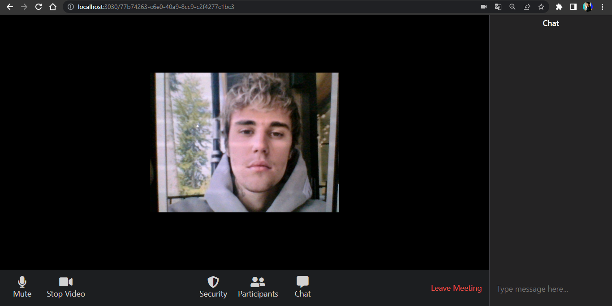

# Node JS Zoom Clone
# just a sample 

# status not completed
# What technology used ?

- [Nodejs](https://nodejs.org/en/)
- [express](https://expressjs.com/)
- [peer](https://peerjs.com/docs/)
- [socket.io](https://socket.io/)
- [ejs](https://ejs.co/)
- [cors](https://www.npmjs.com/package/cors)
- [nodemon](https://www.npmjs.com/package/nodemon)
- [uuid](https://www.npmjs.com/package/uuid)

